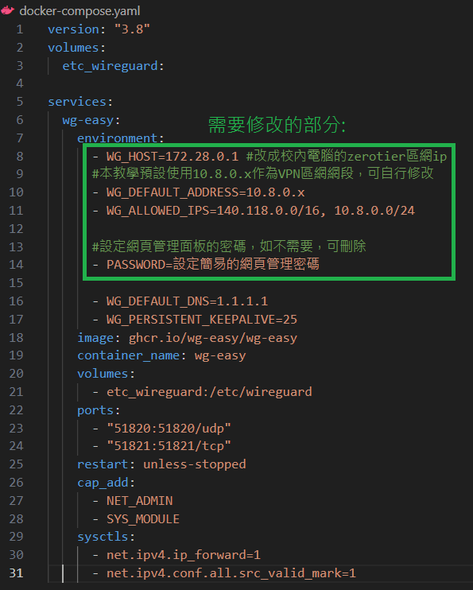

# ntust-wg-easy
 從校外網路用台科校內電腦架設VPN服務連接學校網路 (不須申請) \
 本教學透過 zerotier + wireguard 實現連線
## 閱前聲明
學校近幾年因為資安問題，將校外直連校內ip用防火牆阻擋了 \
如果要存取校內網路，台科校方有提供VPN伺服器，請參閱: \
https://www.cc.ntust.edu.tw/p/404-1050-91023.php?Lang=zh-tw \
本教學目的是提供說明，讓大家都能架設自己的VPN，不需透過學校官方VPN來進行連線 \
免責聲明 :
```
* 本教學不提供任何VPN服務，該方法可能違反學校規範，並且不保證永久有效。
* 強烈譴責任何用於違法/違規之用途，使用者應對其行為負全部責任，作者不承擔任何責任。
* 任何使用的人士，即表示已閱讀、理解並同意以上免責聲明。
```
使用前請詳閱計算機中心之使用規範，確保你沒有違反! \
https://www.cc.ntust.edu.tw/p/412-1050-8537.php?Lang=zh-tw
## 你需要有
* 一台位於校內網路的電腦 (linux/windows/macos...)
* 一台校外的電腦 (linux/windows/macos...)
* 一個zerotier帳號 https://www.zerotier.com/  \
(或者使用具有公共ip之VPS進行異地組網，本文為了方便與金錢考量，使用該服務)
## 名詞解釋
* VPN : 虛擬私人網路，讓你可以透過學校的電腦存取校內網路
* wireguard : 免費開源的VPN伺服器軟體 [wiki](https://zh.wikipedia.org/zh-tw/WireGuard) 
* zerotier : 異地組網服務，用於讓學校電腦可以透過區網訪問，免費版就很夠用了 \
(若是不信任他們的官方伺服器，也可以自己架設[ZeroTierOne](https://github.com/zerotier/ZeroTierOne))

## 架構圖
aaa
## 加入zerotier網路
此步驟在校外/校內電腦都要進行

### 創建network
註冊並登入zerotier.com，進入 https://my.zerotier.com/ \
按下Create A Network，點擊進入，往下滑，選擇你要使用的區網網段 \
本文預設使用`172.28.*.*` \

然後將16碼的network id存起來，之後會用到 \


### Ubuntu安裝zerotier
```
sudo apt install curl
curl -s https://install.zerotier.com | sudo bash
sudo zerotier-cli join 替換成你的network_id
```

### Windows安裝zerotier
進入下載頁面，https://www.zerotier.com/download/ \
安裝windows版的exe，在右下角的system tray中找到它，點擊右鍵，Join New Network，輸入network_id \


### 認證裝置
回到zerotier控制頁面，https://my.zerotier.com/ \
找到新加入的裝置，取個名字，設定一個ip (建議從1開始往上加)

本文預設將校內電腦的ip設為`172.28.0.1`

## 架設wireguard vpn伺服器
此步驟在校內電腦進行

### Ubuntu
```
# 安裝git, docker, docker-compose，已安裝者可跳過
sudo apt install git
curl -sSL https://get.docker.com/ | CHANNEL=stable bash
sudo curl -L "https://github.com/docker/compose/releases/download/1.29.2/docker-compose-$(uname -s)-$(uname -m)" -o /usr/local/bin/docker-compose
sudo chmod +x /usr/local/bin/docker-compose

# 首先找個地方clone專案
git clone https://github.com/frakw/ntust-wg-easy.git
cd ntust-wg-easy
```
開啟`docker-compose.yaml`根據你前面在zerotier的配置進行修改


```
#啟動server
sudo docker compose up -d
```
### Windows

## 校外電腦連線
### Ubuntu
### Windows